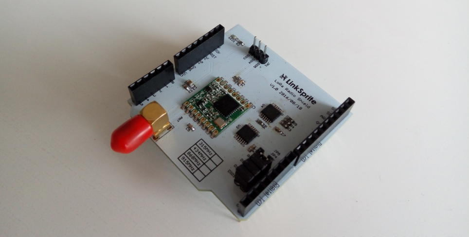
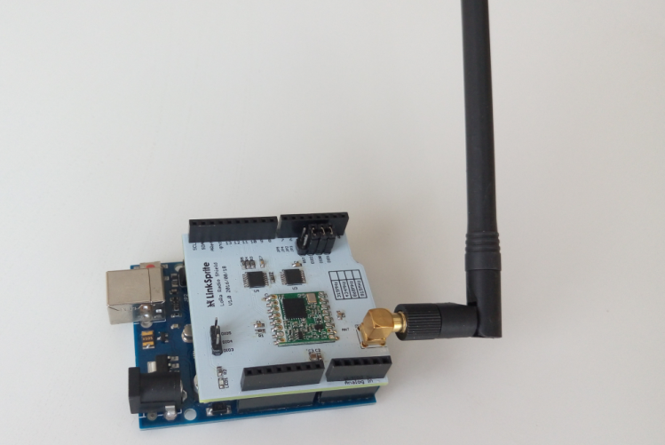
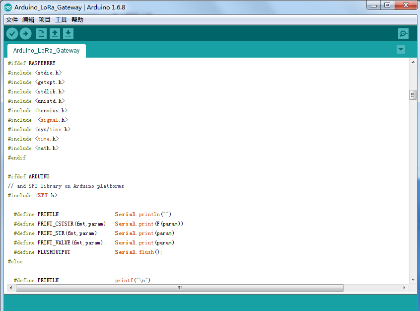
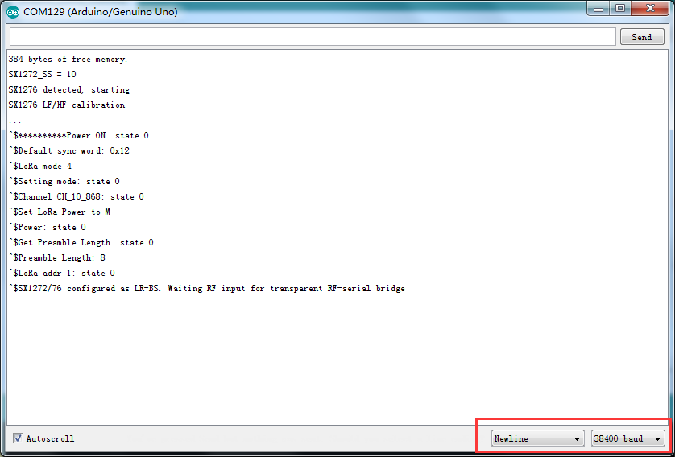
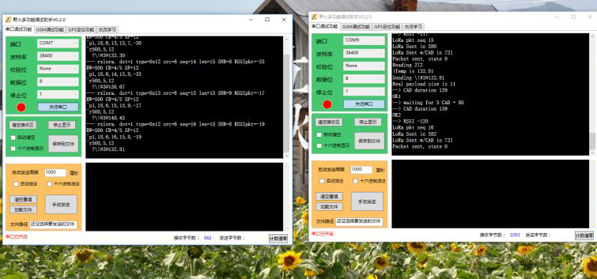
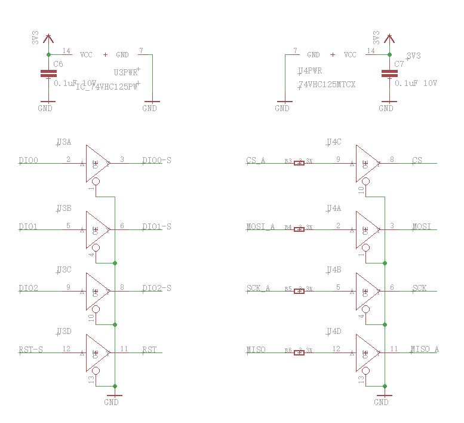

## Introduction
#
This page describes our low-cost LoRa gateway based on a Arduino. The gateway can receive from any LoRa device and is designed to be fully customizable for a targeted application.
The work presented here is part of the EU H2020 WAZIUP project (grant agreement number 687607, 2016-2019) which objective is to develop low-cost IoT solutions for deployment in sub-saharian African countries. Various applications are considered: water quality monitoring, cattle rustling, logistics and goods transportation
There are many advanced and well-integrated LoRa gateways capable of simultaneous reception on several channels and implementing the LoRaWAN specification (see slides). These gateways are based on the SX1301 baseband concentrator. Our LoRa gateway could be qualified as "single connection" as it uses the SX1272, much like an end-device would do. However, in order to increase LoRa transmission robutsness we improve the LoRa transmission with CSMA features (or so-called Listen Before Talk) and add Quality of Service guarantees with regards to radio time limitations. This solution keeps the cost of the gateway low and can satisfy small to medium size deployment scenario for ad-hoc application cases in various private usages, farming, agriculture, infrastructure surveillance, application-specific telemetry systems,... Note that more than 1 gateway can be deployed to serve several channel settings. However, it is probably not adapted, in the current state of development, to large-scale deployment with a large number of end customers from various different organizations with their own and different requirements regarding data management, confidentiality and security.
## Features
* LoRaTM Modem.
* 168 dB maximum link budget.
* +20 dBm - 100 mW constant RF output vs. V supply.
* +14 dBm high efficiency PA.
* Programmable bit rate up to 300 kbps.
* High sensitivity: down to -148 dBm.
* Bullet-proof front end: IIP3 = -12.5 dBm.
* Excellent blocking immunity.
* Low RX current of 10.3 mA, 200 nA register retention.
* Fully integrated synthesizer with a resolution of 61 Hz.
* FSK, GFSK, MSK, GMSK, LoRaTM and OOK modulation.
* Built-in bit synchronizer for clock recovery.
* Preamble detection.
* 127 dB Dynamic Range RSSI.
* Automatic RF Sense and CAD with ultra-fast AFC.
* Packet engine up to 256 bytes with CRC.
* Built-in temperature sensor and low battery indicator.
## Tutorials
#### Prerequisites
##### Hardware
* Arduino UNO x 2
* Linker Radio Shield x 2 
##### Software
Click [here]() to download the code 
Code folder under LowCostLoRaGw, SX1272 into the directory of the Arduino IDE folder libraries directory.
#### Hardware connections
#  
##### Arduino-LoRa-Gateway 
* Open Arduino IDE
* Open File
* Select Examples
* Select SX1272
* Select Arduino-LoRa-Gateway
* Upload code to device
#  
* Open the Arduino IDE Serial Monitor
* Select the right baudrate 
#

#### Arduino-LoRa-temp  
* Open Arduino IDE
* Open File
* Select Examples
* Select SX1272
* Select Arduino-LoRa-temp
* Upload code to device
#  
* Open the Arduino IDE Serial Monitor
* Select the right baudrate 
#  
#### LoRa testing communications
Open the two serial Monitor, one for LoRa-gateway and one for the LoRa-temo,restart both devices, then you can see them start communicating.  
#   
## Schematic   
#  
#  
